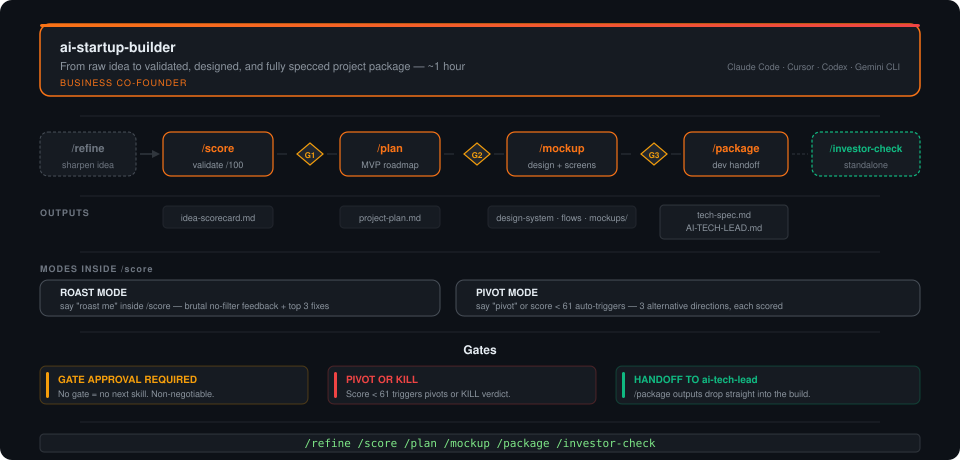

# ai-startup-builder

[](LICENSE)
[](https://claude.ai/code)
[]()

**The business brain before the technical brain.**

Solo founders get a co-founder who challenges ideas before they get built, then produces a complete project package ready to hand to a developer. Built on [Claude Code](https://claude.ai/code).

> **Why not just use Claude?** ai-startup-builder is a structured workflow with scoring frameworks, hard phase gates, and artifact chains — not a general-purpose chatbot. It scores your idea before generating anything, blocks Phase 2 if Phase 1 fails, and says KILL when your idea has structural problems execution won't fix.

```
ai-startup-builder: What's your idea?

You: AI tool for restaurant reservations

ai-startup-builder: OpenTable, Resy, and Yelp have this covered.
                    What does AI unlock that their booking widget can't?
```

<p align="center">
  
</p>

---

## Quick start

```bash
git clone https://github.com/lmagsino/ai-startup-builder.git
cd ai-startup-builder
./setup.sh
```

Then:

```
/ai-startup-builder
```

OWNER INTAKE starts automatically — 5 questions, answer all at once. Works with **Claude Code**, **Cursor**, **Codex**, **Gemini CLI**, and **OpenCode**. See [INSTALL.md](INSTALL.md) for details.

---

## What you get

One session (~1 hour) produces a complete project folder ready to hand to [ai-tech-lead](https://github.com/lmagsino/ai-tech-lead):

```
projects/[name]/
├── idea-scorecard.md       → validation result with score /100
├── project-plan.md         → MVP → V2 → Future roadmap
├── linear-board.md         → paste-ready for Linear
├── design-system.md        → brand, colors, typography
├── user-personas.md        → who you're building for
├── user-flows.md           → core user journeys
├── mockups/                → key screens as HTML
├── tech-spec.md            → for ai-tech-lead /blueprint
└── AI-TECH-LEAD.md         → pre-filled, drop into project repo
```

---

## Phases

| Step | What happens | Output |
|------|-------------|--------|
| **Idea** | Share your idea — one sentence is enough | — |
| **Refinement** | Sharp questions to nail the user, problem, and angle | Sharpened idea |
| **Owner Intake** | Stack, design taste, rules, audience, constraints — all 5 at once | SESSION CONTEXT |
| **Phase 1 — Challenge** | Classify → framework → score /100 → verdict | `idea-scorecard.md` |
| **Phase 2 — Plan** | Roadmap pattern → MVP filter → milestones → GTM → pricing | `project-plan.md` |
| **Phase 3 — Design** | Personas → flows → design system → HTML mockups | `design-system.md`, `user-flows.md`, `mockups/` |
| **Phase 4 — Build Package** | tech-spec → AI-TECH-LEAD.md → Linear board → pitch deck outline | All handoff files |

Each phase ends with a gate. No approval = no next phase.

---

## How it works

**Challenges first.** Every phase opens with a challenge or classification — never with enthusiasm.

**Scored, not vibed.** Every idea gets a /100 score across 7 weighted dimensions. Verdict is automatic: KILL IT, PIVOT IT, BUILD IT, or BET ON IT.

**Hard gates.** Phase N+1 is blocked until Gate N is approved. Score < 61 triggers pivot suggestions before proceeding.

**Artifact chain.** Owner Intake → Scorecard → Project Plan → Design System → Tech Spec → AI-TECH-LEAD.md → handoff.

**Hands off cleanly.** Phase 4 outputs `AI-TECH-LEAD.md` pre-filled with everything [ai-tech-lead](https://github.com/lmagsino/ai-tech-lead) needs. Drop it in the repo and run `/strategy`.

---

## Scoring

Every idea scored /100 across 7 weighted dimensions:

| Dimension | Weight | What earns a high score |
|-----------|--------|------------------------|
| Monetization Clarity | 20% | Clear model with comparable benchmarks |
| Market Size | 15% | Large and growing (>$1B TAM) |
| Competition Density | 15% | Underserved, clear white space |
| Founder-Market Fit | 15% | Deep expertise, lived the problem |
| Time to First Revenue | 15% | <6 months with right execution |
| Technical Feasibility | 10% | Buildable with current tools in <6 months |
| Unfair Advantage | 10% | Strong moat (data, network, IP, brand, access) |

---

## Special modes

| Trigger | Mode | What it does |
|---------|------|-------------|
| `roast me` | ROAST MODE | No-filter brutal feedback — every weak assumption + top 3 fixes |
| `pivot` | PIVOT MODE | 3 alternative directions with new user, monetization, and entry point |
| `investor check` | INVESTOR READINESS | Readiness score /50 — NOT READY / GETTING THERE / READY |

---

## Handoff to ai-tech-lead

```bash
git init [project-name]
cp AI-TECH-LEAD.md [project-name]/
cp tech-spec.md [project-name]/
cp -r design/ [project-name]/
cd [project-name]
claude   # with ai-tech-lead loaded
/strategy
```

She reads `AI-TECH-LEAD.md` and `tech-spec.md`. Outputs `STRATEGY.md` — GO or STOP.

---

## Companion repo

**[ai-tech-lead](https://github.com/lmagsino/ai-tech-lead)** — the technical co-founder who picks up where ai-startup-builder ends.

```
ai-startup-builder  →  Think before you build
                        Business brain. Founder language. ~1 hour.

ai-tech-lead        →  Build after you think
                        Technical brain. Developer language. Days to weeks.

Together            →  Your complete founder OS.
                        Idea to shipped product. No meetings. No gaps.
```

---

## Docs

- [Getting started](docs/getting-started.md) — first session walkthrough
- [Workflows](docs/workflows.md) — common session patterns
- [Customization](docs/customization.md) — tune scoring, frameworks, and stack defaults

---

## Contributing

Issues and PRs welcome — new frameworks, playbooks, roadmap patterns, real scorecards.

Every contribution must include:

```
> WHEN TO USE: [specific trigger]
> TOKEN COST: low | medium | high
> APPLIES TO: saas | marketplace | consumer | b2b | ai-product | all
> SOURCE: [origin or author if applicable]
```

## License

MIT — open source forever.
